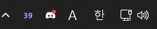
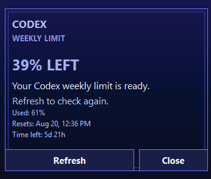

<p align="center">
  
</p>

<p align="center">
  <a href="README.md">English</a> | <b>한국어</b> | <a href="README.ja.md">日本語</a> | <a href="README.zh-CN.md">简体中文</a> | <a href="README.ru.md">Русский</a>
</p>

# Codex Weekly Limit Tray

Codex 주간 사용 한도를 Windows 시스템 트레이에 표시하는 작은 네이티브 앱입니다.

트레이 아이콘에는 `73` 같은 큰 굵은 숫자가 표시되며, 한도 정보를 아직 받지 못했을 때는 `--`가 표시됩니다. 아이콘을 클릭하면 Codex 패널이 열립니다. 패널에는 남은 양, 초기화 시각, 남은 시간이 표시됩니다.

<p align="center">
  <br>
  <sub><em>트레이 아이콘</em></sub>
  <br><br>
  <br>
  <sub><em>상세 패널</em></sub>
</p>

## 준비물

- x64 기반 Windows 10 또는 Windows 11
- 공식 [Codex CLI](https://developers.openai.com/codex/cli/)

소스에서 빌드하려면 MSYS2 UCRT64 C++ 컴파일러를 설치하세요. 빌드 스크립트는 `%USERPROFILE%\msys64\ucrt64\bin\g++.exe`를 먼저 확인하고, 다음으로 `C:\msys64\ucrt64\bin\g++.exe`를 확인하며, `CXX` 환경 변수로 전달된 전체 경로를 사용할 수도 있습니다.

앱은 Windows의 사용자별 Local AppData 알려진 폴더(known folder)를 통해 Codex를 찾습니다. 일반적인 위치는 다음과 같습니다.

```text
%LOCALAPPDATA%\Programs\OpenAI\Codex\bin\codex.exe
```

## 앱 실행

공개 릴리스를 사용할 때는 ZIP을 풀고 `CodexWeekUsageTray.exe`를 실행하세요.

소스에서 빌드하고 실행하려면 다음과 같이 합니다.

```powershell
native\build.cmd
native\out\CodexWeekUsageTray.exe
```

아이콘은 일반적인 Windows 시스템 트레이에 표시됩니다. 시계나 날짜를 가리지 않습니다.

### 첫 실행 시 SmartScreen 경고

릴리스 EXE는 아직 Authenticode 서명이 되어 있지 않아, 처음 실행하면 **Windows의 PC 보호** 경고가 표시됩니다. 신뢰하기 전에 파일을 확인하세요.

```powershell
Get-FileHash .\CodexWeekUsageTray.exe -Algorithm SHA256
```

결과값을 같은 릴리스의 `SHA256SUMS-<version>.txt` 파일에 있는 해당 줄과 비교하세요. 값이 일치하면 **추가 정보 > 실행**을 선택합니다. 서명되지 않은 실행 파일을 아예 실행하고 싶지 않다면, 위의 방법으로 소스에서 직접 빌드하세요.

### 트레이 아이콘 표시하기

1. `CodexWeekUsageTray.exe`를 실행합니다.
2. **설정 > 개인 설정 > 작업 표시줄 > 기타 시스템 트레이 아이콘**을 엽니다.
3. **CodexWeekUsageTray**를 찾아 **켬**으로 설정합니다.

이렇게 하면 Windows가 아이콘을 숨김 목록에 두지 않고 시스템 트레이에 표시합니다.

## 패널 사용법

- **트레이 아이콘 왼쪽 클릭**: 상세 패널을 열거나 숨깁니다.
- **트레이 아이콘 오른쪽 클릭** 후 **Show panel** 선택: 트레이 메뉴에서 상세 패널을 엽니다.
- **Refresh**: 한도를 지금 바로 확인합니다.
- **Close**: 패널만 숨깁니다. 트레이 앱은 계속 실행됩니다.
- **Sign in**: 필요할 때 기본 브라우저에서 공식 Codex ChatGPT 로그인 페이지를 엽니다.
- **Check**: 로그인 후 계정을 다시 확인합니다.

Codex가 한도 업데이트를 보내면 앱이 즉시 갱신합니다. 또한 대비책으로 최소 5초 간격으로 확인합니다.

## 빌드 점검

```powershell
native\build.cmd tests
native\out\CodexWeekUsageTrayTests.exe
native\out\CodexWeekUsageTray.exe --self-test
```

## 저장된 트레이 항목 제거

테스트 과정에서 **기타 시스템 트레이 아이콘**에 예전 항목이 남았다면, `CodexWeekUsageTray.exe`와 같은 폴더에 있는 `uninstall.cmd`를 두 번 클릭하세요. 정리가 즉시 시작되며, 입력해야 하는 단어나 확인 창은 없습니다.

`uninstall.cmd`는 일치하는 `CodexWeekUsageTray.exe` 프로세스를 종료하고 해당 항목의 현재 사용자 트레이 설정만 제거합니다. 이전 릴리스를 교체하기 전이나 중복된 트레이 항목이 남아 있을 때 유용합니다. EXE 파일을 삭제하거나 다른 앱의 트레이 설정을 변경하지 않습니다.

릴리스 폴더에서 터미널을 열어 다음과 같이 실행할 수도 있습니다.

```powershell
.\CodexWeekUsageTray.exe --uninstall-dry-run
.\CodexWeekUsageTray.exe --uninstall
```

드라이런은 정확히 일치하는 `CodexWeekUsageTray.exe` 항목만 나열하며 아무것도 변경하지 않습니다.

## 보안 및 개인정보

- 앱은 비밀번호, API 키, 리프레시 토큰, 사용 기록을 읽거나 출력하거나 저장하거나 업로드하지 않습니다.
- 로그인 URL은 HTTPS를 사용해야 하며 호스트가 정확히 `chatgpt.com` 또는 `auth.openai.com`일 때만 기본 브라우저로 열립니다.
- 네이티브 호스트에는 업데이터, 다운로더, 시작 프로그램 등록, 앱 자체 네트워크 클라이언트가 없습니다. 계정 관련 통신은 Codex CLI가 로컬 stdio 연결을 통해 직접 처리합니다.
- 릴리스 EXE는 아직 Authenticode 서명이 되어 있지 않습니다. 내려받은 파일을 실행하기 전에 공개된 SHA-256 값을 확인하세요.

v2.0.1 이후 릴리스에는 EXE, `uninstall.cmd`, 그리고 이에 대응하는 `SHA256SUMS-<version>.txt` 매니페스트가 포함됩니다. 압축 파일에는 .NET 런타임, DLL, PDB가 들어 있지 않습니다. v2.0.0에는 EXE만 포함되어 있었습니다.

앱은 현재 한도를 메모리에만 보관합니다. Windows가 일반적인 알림 아이콘 설정을 유지할 수 있으며, Codex CLI는 자체 세션 데이터를 보관합니다.
